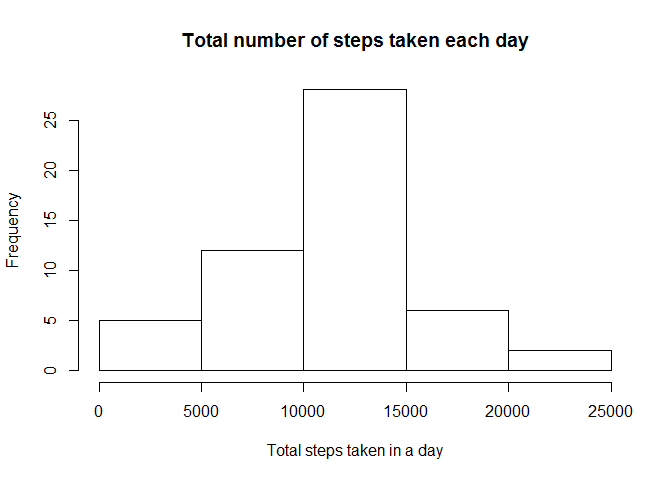
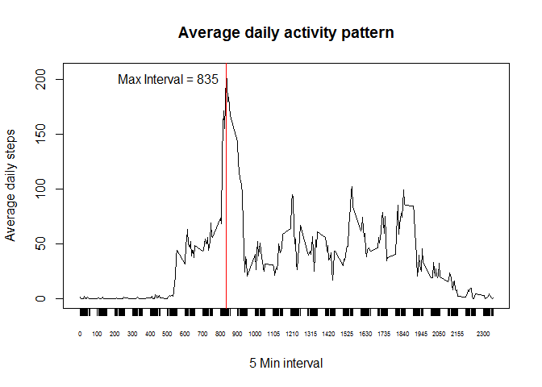
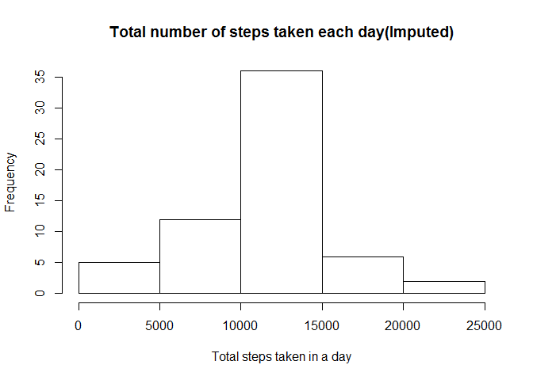
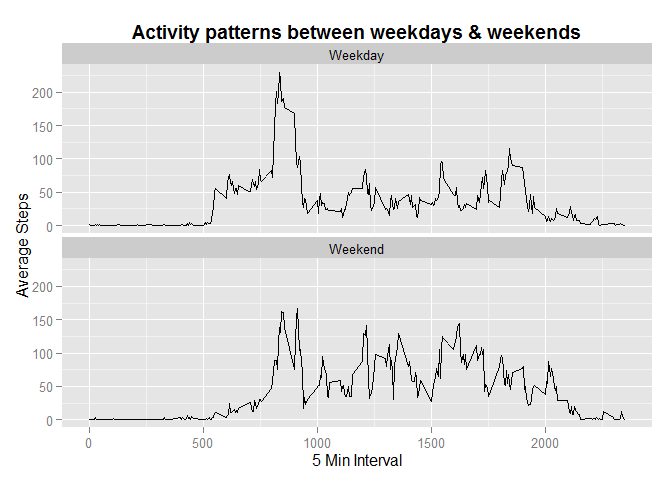

Reproducible Research: Peer Assessment 1
=============================================================
        Author Srinivasan Sastry 
        Date   20-Sep-2015
        

## Loading and preprocessing the data

```r
library(curl)
library(dplyr)
library(date)
library(lubridate)
library(ggplot2)
```

####Load the data 


```r
#Load the data and unzip 
curl_download(url= 'https://d396qusza40orc.cloudfront.net/repdata%2Fdata%2Factivity.zip',destfile='repdata_activity.zip')
```

####Process/transform the data (if necessary) into a format suitable for your analysis


```r
activity_data <- read.csv(unz("repdata_activity.zip", "activity.csv"), header=TRUE, as.is = TRUE, colClasses = c("integer","Date","integer"))
```

## What is mean total number of steps taken per day?

####For this part of the assignment, you can ignore the missing values in the dataset.

```r
#omit NA rows and load them into another data frame, summarise so we can plot the first histogram
act_data <- na.omit(activity_data)
```

1. Calculate the total number of steps taken per day

```r
mn <- summarise(group_by(act_data,date),m=mean(steps),s= sum(steps))
```

2. If you do not understand the difference between a histogram and a barplot, research the difference between them. Make a histogram of the total number of steps taken each day

```r
# we are making the historgram and not a bar graph as defined by the question 
# based on the total no of steps calculated in the previous step
hist(mn$s,main="Total number of steps taken each day",
     xlab="Total steps taken in a day")
```

 

3. Calculate and report the mean and median of the total number of steps taken per day

```r
# Calculate mean and median
median(mn$s)
```

```
## [1] 10765
```

```r
mean(mn$s)
```

```
## [1] 10766.19
```

## What is the average daily activity pattern?
1. Make a time series plot (i.e. type = "l") of the 5-minute interval (x-axis) and the average number of steps taken, averaged across all days (y-axis)


```r
#In order to make a time seies plot we need to group by the  5 minutes intervals of the day 
#when the activity reading was taken across all days 

mni <- summarise(group_by(act_data,interval),m=mean(steps))

#plot the time series and add an axis to see the maxium better for the next question
plot(m ~ interval, mni, xaxt = "n", type = "l",main="Average daily activity pattern", 
     xlab="5 Min interval", ylab="Average daily steps")
axis(1, mni$interval, cex.axis = .5)
top_label<-paste("Max Interval = ", format((mni[mni$m == max(mni$m),]$interval), digits=2), sep="") 
abline(v=(mni[mni$m == max(mni$m),]$interval), col="red") 
text(mni[mni$m == max(mni$m),]$interval, 200, top_label, pos=2) 
```

 

2. Which 5-minute interval, on average across all the days in the dataset, contains the maximum number of steps?

```r
#from the graph it is evident the that 835 minute interval contains maximum no of steps across all daya
#also confirmed by the code below
 mni[mni$m == max(mni$m),]
```

```
## Source: local data frame [1 x 2]
## 
##   interval        m
## 1      835 206.1698
```

## Imputing missing values
Note that there are a number of days/intervals where there are missing values (coded as NA). The presence of missing days may introduce bias into some calculations or summaries of the data.

1. Calculate and report the total number of missing values in the dataset (i.e. the total number of rows with NAs)

```r
#load the NA cases into a data frame to know the no of total no of missing values 
#and also to help processing for further 

 na_list <- activity_data[!complete.cases(activity_data),]
nrow(na_list)
```

```
## [1] 2304
```

2. Devise a strategy for filling in all of the missing values in the dataset. The strategy does not need to be sophisticated. For example, you could use the mean/median for that day, or the mean for that 5-minute interval, etc.

```r
#I am using the mean for the interval to impute the missing values. The preprocessing steps 
#are as follows 
na_data <- subset (merge(mni, na_list, by.x = "interval",by.y = "interval"), select = -steps)
colnames(na_data)[2] <- "steps"
```

3. Create a new dataset that is equal to the original dataset but with the missing data filled in.

```r
#Rbind both complete cases and data that are filled in to get back the complete 
#data set filled in. Check if there are NA's in the final set
act_dat1 <- rbind(activity_data[complete.cases(activity_data),],na_data)
sum(complete.cases(activity_data)) 
```

```
## [1] 15264
```

4. Make a histogram of the total number of steps taken each day and Calculate and report the mean and median total number of steps taken per day. Do these values differ from the estimates from the first part of the assignment? What is the impact of imputing missing data on the estimates of the total daily number of steps

```r
#summarise the new filled in data set
mn_filled <- summarise(group_by(act_dat1,date),m=mean(steps),s= sum(steps))

#create the histogram based on the total number of steps from the imputed data set
hist(mn_filled$s,main="Total number of steps taken each day(Imputed)",
     xlab="Total steps taken in a day")
```

 

```r
#Calculate the mean and Median. Since i used the mean to fill up the data the mean has 
#not shifted , however the median has shifted
median(mn_filled$s)
```

```
## [1] 10766.19
```

```r
mean(mn_filled$s)
```

```
## [1] 10766.19
```

## Are there differences in activity patterns between weekdays and weekends?
For this part the weekdays() function may be of some help here. Use the dataset with the filled-in missing values for this part.

1. Create a new factor variable in the dataset with two levels - "weekday" and "weekend" indicating whether a given date is a weekday or weekend day.


```r
#I am creating a factor variable wkd_wke and adding it to the data set, using lubridate funcion.I felt this will give lesser steps
#than using weekdays(), as it is just a suggetion

act_dat1 <- act_dat1 %>% mutate(wkd_wke = factor(ifelse ( (wday(date) == 1 | wday(date) == 7), "Weekend","Weekday"))) 
```


2. Make a panel plot containing a time series plot (i.e. type = "l") of the 5-minute interval (x-axis) and the average number of steps taken, averaged across all weekday days or weekend days (y-axis). See the README file in the GitHub repository to see an example of what this plot should look like using simulated data.


```r
#Summarise the based on new factor variable and interval 
mniw <- summarise(group_by(act_dat1,wkd_wke,interval),m=mean(steps))

# I am using ggplot2 to plot the week day and week end panels. The instructions does not mandate 
#using lattice plot 
k<- ggplot(data=mniw,aes(x=interval,y=m ))
k<-k+facet_wrap(~wkd_wke,ncol=1)
k<-k+geom_line()
k<- k+ xlab("5 Min Interval")
k<- k+ ylab("Average Steps")
k<- k+ ggtitle("Activity patterns between weekdays & weekends") + theme(plot.title = element_text(lineheight=3, face="bold", color="black", size=14))
print(k)
```

 
